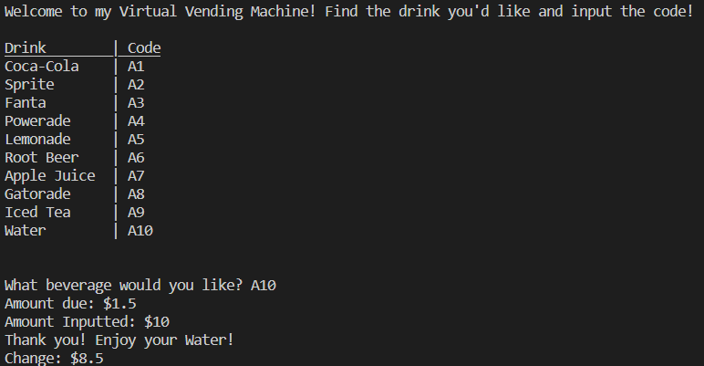

# Vending-Machine
Use my Virtual Vending Machine to get a refreshing drink!

The program is written in Python.

# Description
The user will select a drink and pay for it using 5, 10 and 25 cent coins.

